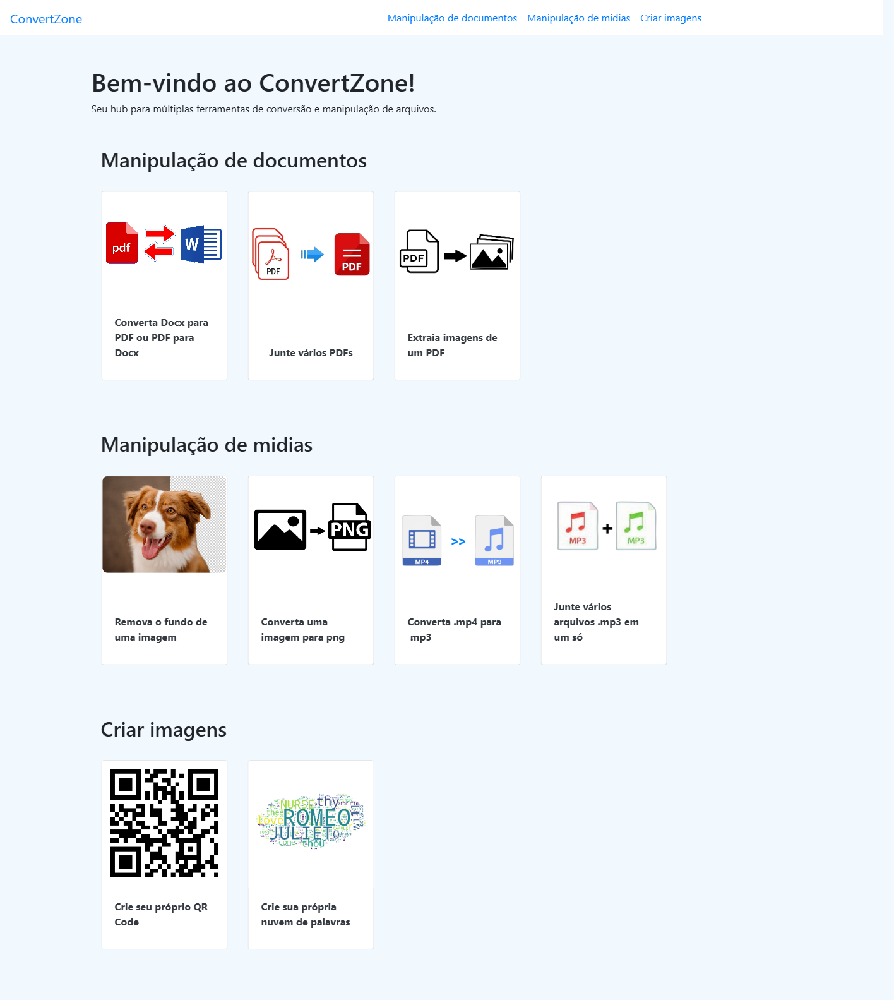
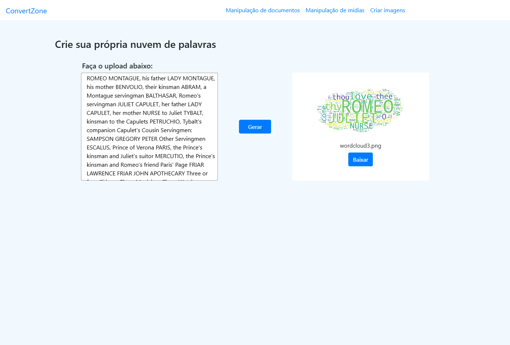
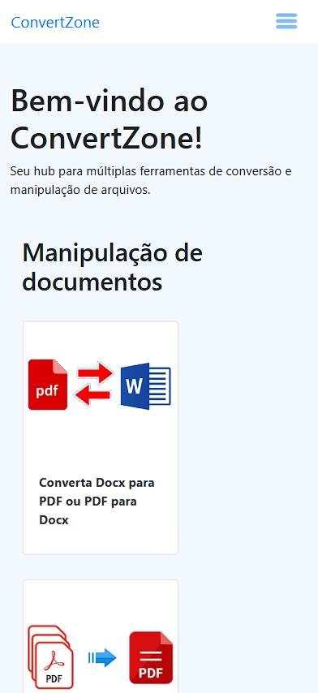
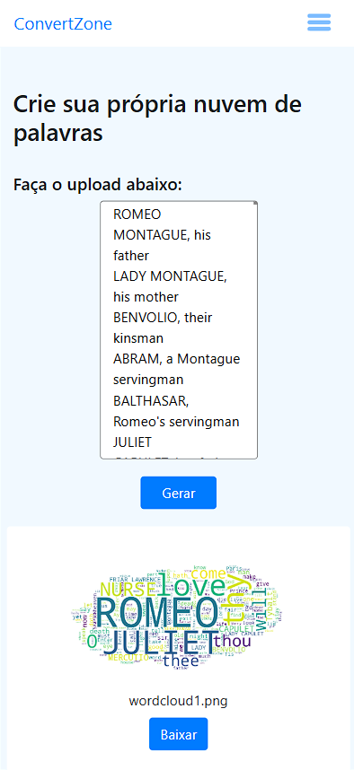

# ConvertZone

ConvertZone é um hub de ferramentas para conversão e manipulação de arquivos, projetado para oferecer uma interface amigável e suporte a múltiplos formatos. Ideal para profissionais, estudantes ou qualquer pessoa que precise converter arquivos de forma eficiente.


## 🧩 Funcionalidades Principais

- **Conversão de Formatos de Arquivo**: Transforme arquivos de um formato para outro de forma simples.
- **Suporte a Múltiplos Tipos de Arquivo**: Compatível com formatos de texto, imagem, áudio e vídeo.
- **Interface Intuitiva**: Uma interface clara e fácil de navegar, ideal para usuários de todos os níveis.
- **Escalabilidade**: Fácil de estender para suportar novos tipos de arquivos e funcionalidades.


## 🚀 Tecnologias Utilizadas

O projeto utiliza tecnologias modernas para garantir performance, escalabilidade e uma boa experiência de usuário:

### Backend:
- **Python**: Linguagem principal para o backend.
- **Flask**: Framework web usado para construir a API e o servidor.
- **Outras**: Listadas no arquivo [requirements](requirements.txt).

### Frontend:
- **HTML5 e CSS3**: Estruturação e estilização do frontend.
- **JavaScript**: Adiciona interatividade ao site.
- **Bootstrap**: Framework CSS para um design responsivo.

## 🛠️ Instalação e Configuração

Siga os passos abaixo para instalar e configurar o projeto na sua máquina local:

### Pré-requisitos

- Python 3.8 ou superior.
- Git.
- Um navegador web atualizado.

### Passos

1. **Clone o Repositório**:
   ```bash
   git clone https://github.com/wand-CE/ConvertZone.git
   ```

2. **Acesse o Diretório do Projeto**:
   ```bash
   cd ConvertZone
   ```

3. **Crie um Ambiente Virtual (opcional, mas recomendado)**:
   ```bash
   python -m venv venv
   source venv/bin/activate  # No Windows: venv\Scripts\activate
   ```

4. **Instale as Dependências**:
   ```bash
   pip install -r requirements.txt
   ```

5. **Execute o Servidor**:
   ```bash
   python app.py
   ```

6. **Acesse no Navegador**:
   Abra [http://localhost:5000](http://localhost:5000) no navegador para usar a aplicação.


## 📖 Como Usar

1. **Carregue o Arquivo**: Faça o upload do arquivo que deseja converter.
2. **Selecione o Formato**: Escolha o formato de saída desejado.
3. **Clique em Converter**: A ferramenta processará o arquivo e fornecerá o link de download.


## 🧑‍💻 Contribuindo

Quer contribuir com o ConvertZone? Siga os passos abaixo:

1. **Faça um Fork**:
   Clique no botão "Fork" no topo da página do repositório.

2. **Clone o Repositório**:
   ```bash
   git clone https://github.com/seu-usuario/ConvertZone.git
   ```

3. **Crie uma Nova Branch**:
   ```bash
   git checkout -b minha-nova-feature
   ```

4. **Implemente sua Funcionalidade ou Correção**.

5. **Faça o Commit das Alterações**:
   ```bash
   git commit -m "Adiciona nova funcionalidade"
   ```

6. **Envie as Alterações**:
   ```bash
   git push origin minha-nova-feature
   ```

7. **Abra um Pull Request**:
   No repositório original, clique em "New Pull Request" e envie suas alterações para revisão.

---

## 🎯 Evidências de Execução

### DESKTOP

#### Tela principal desktop:


#### Tela funcionalidade da nuvem de palavras desktop:


---
### MOBILE

#### Telas Mobile:
 


## 🎯 Próximos Passos

- Adicionar suporte a mais tipos de arquivo.
- Melhorar a interface com animações e feedback visual.
- Implementar um sistema de autenticação para salvar o histórico do usuário.

---

Se você tiver alguma dúvida ou sugestão, fique à vontade para entrar em contato ou abrir uma issue no repositório!
